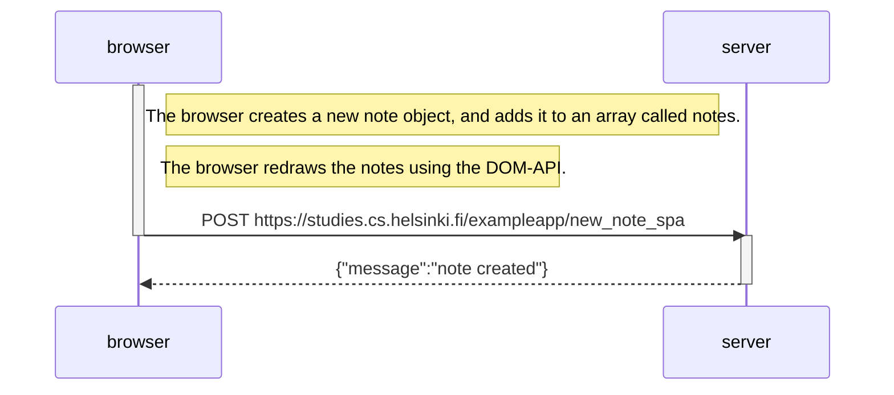

```mermaid
sequenceDiagram
    participant browser
    participant server

    activate browser
    Note right of browser: The browser creates a new note object, and adds it to an array called notes.
    Note right of browser: The browser redraws the notes using the DOM-API.
    browser->>server: POST https://studies.cs.helsinki.fi/exampleapp/new_note_spa
    deactivate browser
    activate server
    server-->>browser: {"message":"note created"}
    deactivate server

```
